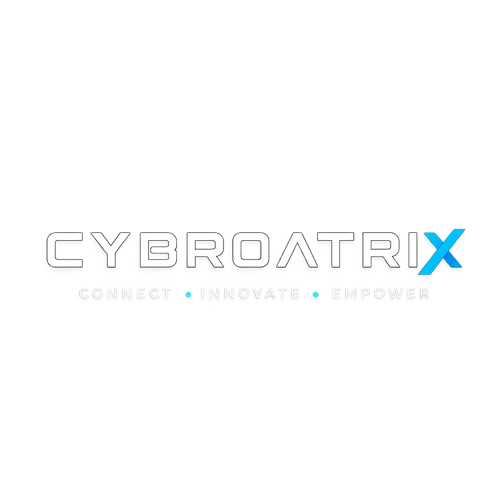
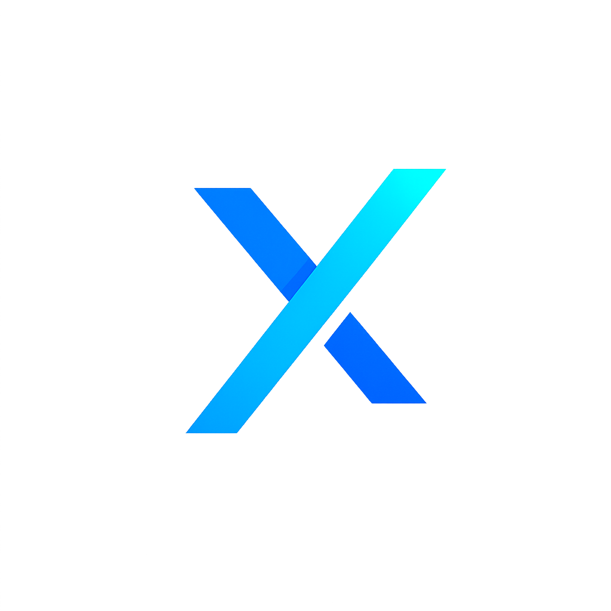
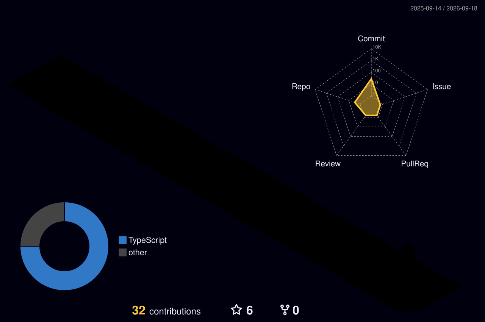

# 🌐 CybroatriX

### **Connect • Innovate • Empower**

 

---

#  About CybroatriX

CybroatriX is a technology-driven initiative dedicated to advancing innovation in **Cybersecurity**, **Artificial Intelligence**, **Software Engineering**, and **Open Source Development**.

Our goal is to create secure, intelligent, and impactful solutions while fostering a global community of developers, learners, and innovators.

We believe technology should not only solve problems—but inspire people to build the future.

---

# 🎯 Mission

- 🛡 Build secure digital solutions
- 🤖 Advance Artificial Intelligence
- 🌍 Empower developers worldwide
- 📚 Share knowledge through open source
- 🚀 Build innovative products
- 💙 Grow a collaborative technology community

---

# 🚀 Areas of Focus

| Technology | Description |
|------------|-------------|
| 🛡 Cybersecurity | Ethical Hacking, Digital Forensics, OSINT, Web Security |
| 🤖 Artificial Intelligence | AI Applications, Automation, Local AI Models |
| 🌐 Web Development | Modern Full-Stack Web Applications |
| ⚙ Software Engineering | Desktop Applications & Utilities |
| 🎮 Game Development | Python & Interactive Experiences |
| ☁ Cloud Computing | Cloud Infrastructure & Deployment |
| 📱 Mobile Development | Cross-platform Solutions |
| 📚 Education | Tutorials & Open Learning Resources |

---

# 💻 Technology Stack

---

# 📊 GitHub Statistics

---

# 📈 Most Used Languages

---

# 🏆 GitHub Trophies

---

# 🐍 Contribution Snake

---

# 🧊 3D Contribution Graph

---

# 🚀 Current Projects

- 🤖 AI Assistant
- 🔐 Cybersecurity Research
- 🌐 CybroatriX Website
- 📚 Educational Content
- 🛠 Developer Tools
- 🚀 Open Source Projects

---

# 📖 Learning & Research

Currently exploring:

- Artificial Intelligence
- Machine Learning
- Ethical Hacking
- Reverse Engineering
- Malware Analysis
- Digital Forensics
- Cloud Computing
- Full Stack Development

---

# 🌍 Roadmap

- ✅ Build Community
- ✅ Launch Website
- 🔄 Open Source Projects
- 🔄 AI Products
- 🔄 Cybersecurity Tools
- 🔄 Learning Platform
- 🔄 Developer Resources
- 🔄 Global Community

---

# 🌐 Connect With Us

---

# ⭐ CybroatriX

### **Connect • Innovate • Empower**

*"Innovation begins with curiosity. Security begins with knowledge."*

